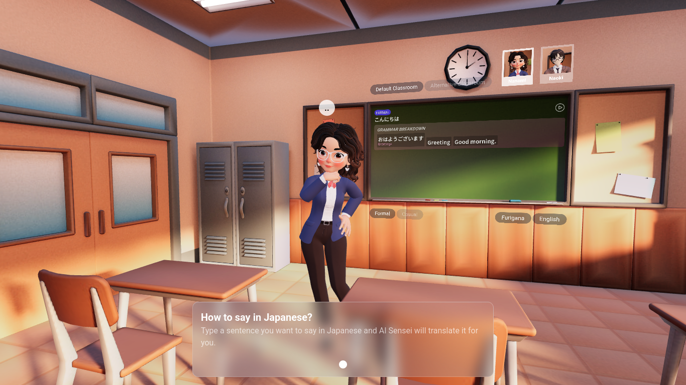
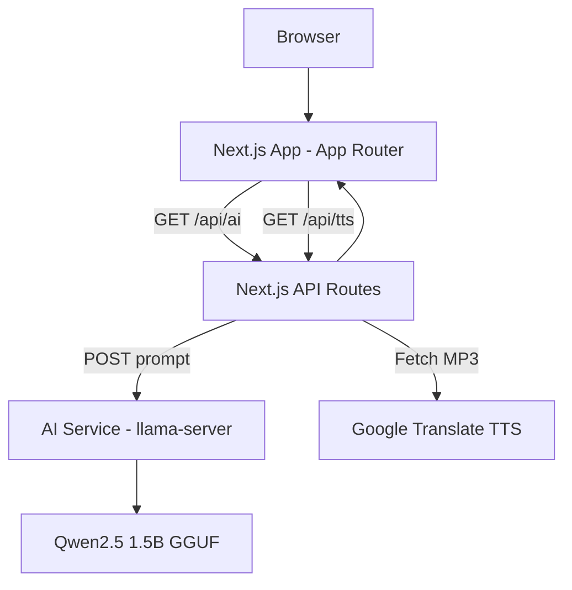
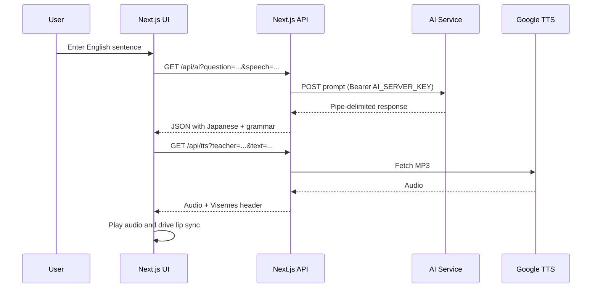

<h1>
  
  Ryoshi
</h1>

> Ryoshi is a 3D Japanese learning app that translates English into Japanese with grammar breakdowns and lip-synced teacher narration.

Ryoshi combines a 3D classroom scene with AI translation and text-to-speech to help learners understand phrasing and pronunciation. It is intended for self-guided learners, demo environments, and teams prototyping AI-powered language tutoring experiences.

## Preview / Screenshot



## Badges


## What This Project Is

- A Next.js App Router web app that renders a 3D classroom scene using React Three Fiber and Drei.
- An AI translation pipeline that calls a separate AI service via `/api/ai` and converts pipe-delimited model output into structured Japanese grammar data.
- A text-to-speech pipeline via `/api/tts` that returns MP3 audio plus viseme metadata for lip sync.
- UI controls to switch teachers, classrooms, speech style, and toggles for furigana and English display.

## AI Output Notice

> **Warning**  
> AI-generated translations and grammar breakdowns can be inaccurate or hallucinated. Verify outputs before using them in real-world or high-stakes contexts.

## Tech Stack

### Core Frameworks
- Next.js (App Router)
- React
- TypeScript
- Zustand

### Rendering / UI
- Three.js
- `@react-three/fiber`
- `@react-three/drei`
- Tailwind CSS v4 (PostCSS)
- Leva (debug controls)
- `next/font/google` (Roboto, Noto Sans JP)

### Networking
- Next.js Route Handlers (`/api/ai`, `/api/tts`)
- Fetch API (client and server)
- `google-tts-api` (server-side audio fetch)

### Physics / Simulation
Not explicitly defined in the repository.

### Infrastructure
- Dockerized AI service in `ai.service`
- `llama-server` binary (from `llama-bin.tar.gz`)
- Qwen2.5 1.5B Instruct GGUF model download at build time

### Tooling
- ESLint (Next.js configs)
- Prettier + `prettier-plugin-tailwindcss`
- TypeScript

## Architecture Overview

Ryoshi uses a client-server architecture where a Next.js app renders the UI and 3D scene, while server-side API routes act as a backend-for-frontend. The `/api/ai` route calls a separate AI service (llama-server) to generate translations and grammar breakdowns. The `/api/tts` route fetches MP3 audio from Google Translate TTS and generates viseme metadata for lip sync.



## Project Structure

```text
.
├─ ai.service/
│  ├─ Dockerfile
│  ├─ run.sh
│  ├─ llama-bin.tar.gz
│  └─ README.md
├─ web/
│  ├─ app/
│  │  ├─ api/
│  │  │  ├─ ai/route.ts
│  │  │  ├─ tts/route.ts
│  │  │  └─ _lib/security.ts
│  │  ├─ globals.css
│  │  ├─ layout.tsx
│  │  └─ page.tsx
│  ├─ components/
│  ├─ hooks/
│  ├─ constants/
│  ├─ public/
│  ├─ package.json
│  └─ tsconfig.json
└─ logo.png.local
```

- `ai.service/`: Dockerized AI backend that runs `llama-server` and downloads the GGUF model.
- `web/app/`: Next.js App Router entry points, route handlers, and global styles.
- `web/components/`: React Three Fiber scene, UI overlays, and interaction controls.
- `web/hooks/`: Zustand store and AI/TTS orchestration logic.
- `web/constants/`: Camera presets and 3D item placement.
- `web/public/`: 3D models, textures, and static images.

## Core Modules

**`web/hooks/use-ai-teacher.tsx`**  
Purpose: Central Zustand store for messages, teacher selection, classroom selection, and playback state.  
Interactions: Called by UI components and triggers `/api/ai` and `/api/tts` requests.  
Design decisions: Stores audio playback state and viseme timing per message, and detunes the Naoki voice client-side.

**`web/app/api/ai/route.ts`**  
Purpose: Validates input, calls the AI server, and normalizes model output into the UI’s JSON format.  
Interactions: Calls the upstream AI service using `AI_SERVER_URL` and `AI_SERVER_KEY`.  
Design decisions: Uses a pipe-delimited format plus a grammar to enforce structure and keeps temperature low.

**`web/app/api/tts/route.ts`**  
Purpose: Generates TTS audio and viseme metadata for lip sync.  
Interactions: Fetches MP3 audio from Google Translate TTS and returns `Visemes` in headers.  
Design decisions: Uses heuristic per-character viseme timing and supports two teacher personas.

**`web/app/api/_lib/security.ts`**  
Purpose: Centralized API guard for methods, rate limiting, and optional API key enforcement.  
Interactions: Used by `/api/ai` and `/api/tts` handlers.  
Design decisions: In-memory rate limiting keyed by IP and optional origin allowlist.

**`web/components/experience.tsx`**  
Purpose: Root 3D scene renderer and UI overlay container.  
Interactions: Reads state from `useAITeacher`, renders 3D classroom and teacher, and overlays messages/settings.  
Design decisions: Uses `Html` overlay within the 3D scene to place the message board.

**`web/components/teacher.tsx`**  
Purpose: Loads teacher models and drives animations and lip sync.  
Interactions: Uses visemes from `useAITeacher` to set morph targets during audio playback.  
Design decisions: Blending between idle/talking animations and morph targets for mouth shapes.

**`ai.service/Dockerfile` and `ai.service/run.sh`**  
Purpose: Builds and runs `llama-server` with a local GGUF model and API key enforcement.  
Interactions: Exposes the AI completion endpoint consumed by `/api/ai`.  
Design decisions: Downloads the Qwen2.5 1.5B Instruct GGUF model at build time.

## Runtime Flow



## Setup & Installation

Prerequisites:
- Node.js (version not explicitly defined; use a version compatible with Next.js 16).
- npm (a `package-lock.json` is present).
- Docker (required only if you run the local AI service).

Web app setup:
```bash
cd web
npm install
```

AI service setup (required for `/api/ai` to function):
```bash
docker build -t ryoshi-ai ./ai.service
docker run --rm -e API_KEY=your_key -p 7860:7860 ryoshi-ai
```

## Running the Project

Development:
```bash
cd web
npm run dev
```

Production build:
```bash
cd web
npm run build
```

Production start:
```bash
cd web
npm run start
```

## Configuration

### Web App (`web`)

| Variable | Description | Required | Default |
| --- | --- | --- | --- |
| `AI_SERVER_URL` | AI completion endpoint used by `/api/ai`. | Yes (for AI) | None |
| `AI_SERVER_KEY` | Bearer token for the AI service. | Yes (for AI) | None |
| `API_ACCESS_KEY` | API key for protecting Next.js routes. | Conditional | None |
| `API_AUTH_REQUIRED` | If `true`, routes require `API_ACCESS_KEY`. | No | `false` |
| `APP_ORIGIN` | Comma-separated allowlist for request origins. | No | Empty (allow all) |
| `AI_RATE_LIMIT_MAX` | Max AI requests per IP per window. | No | `20` |
| `AI_RATE_LIMIT_WINDOW_MS` | AI rate limit window in ms. | No | `60000` |
| `AI_MAX_CHARS` | Max characters per AI question. | No | `200` |
| `TTS_RATE_LIMIT_MAX` | Max TTS requests per IP per window. | No | `30` |
| `TTS_RATE_LIMIT_WINDOW_MS` | TTS rate limit window in ms. | No | `60000` |
| `TTS_MAX_CHARS` | Max characters per TTS request. | No | `300` |
| `TTS_FETCH_TIMEOUT_MS` | Upstream TTS fetch timeout in ms. | No | `8000` |
| `NEXT_PUBLIC_API_KEY` | Client-side API key forwarded as `x-api-key`. | No | None |

### AI Service (`ai.service`)

| Variable | Description | Required | Default |
| --- | --- | --- | --- |
| `API_KEY` | API key required by `llama-server`. Should match `AI_SERVER_KEY`. | Yes | None |
| `PORT` | HTTP port for `llama-server`. | No | `7860` |

## Gameplay / Usage

- Open the app in the browser.
- Choose a teacher (Nanami or Naoki) and a classroom layout.
- Select speech style (formal or casual) and toggle furigana or English.
- Enter an English sentence and press `Enter` or click `Ask`.
- Use the play/stop button to replay audio with lip-synced animation.

## Multiplayer / Networking Notes

Not applicable. Networking is limited to HTTP calls for AI translation and TTS.

## Limitations

- `/api/ai` relies on a pipe-delimited model response, which is brittle if the model output deviates.
- Rate limiting is in-memory and per server instance; it resets on restart and does not scale horizontally.
- TTS depends on Google Translate TTS via an unofficial endpoint; availability and rate limits are outside this codebase.
- API routes accept only GET and use query strings, limiting input length and exposing content in URLs.
- The AI model is downloaded during Docker image build, requiring network access at build time.

## Future Improvements

- Switch to structured JSON output from the AI server to remove pipe parsing.
- Add caching for AI responses and TTS audio.
- Move rate limiting to a shared store (for example Redis) to support horizontal scaling.
- Add a `.env.example` and a `docker-compose.yml` to streamline setup.
- Add automated tests and CI workflows.

## License
MIT License. See [](./LICENSE).
